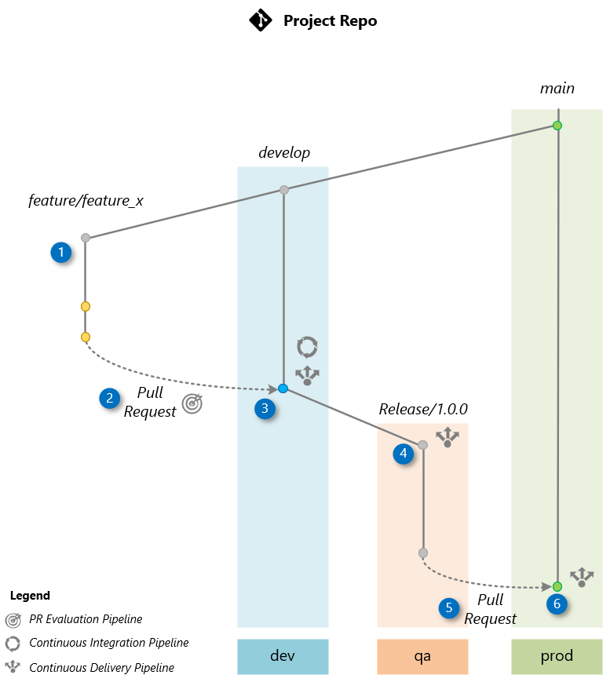
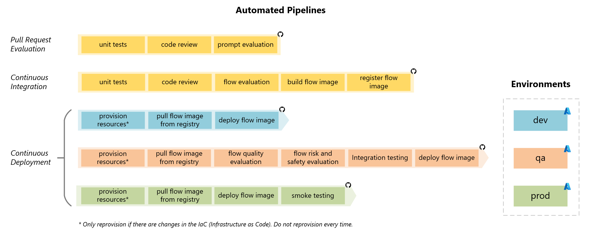

#### 레슨 5: 모든 것을 자동화하기

##### 시나리오

이 연습에서는 LLM 오케스트레이션 플로우의 빌드, 평가 및 배포를 자동화하는 방법을 배우게 됩니다. **LLMOps 가속기**를 사용하여 **Prompt Flow** 및 **GitHub Actions**를 사용하여 LLM을 배포하는 방법을 알아보겠습니다. 이 자동화는 텔코 회사에게 매우 중요한 역할을 하며, 24/7 지원 가상 에이전트를 위한 효율적이고 오류 없는 배포 프로세스를 가능하게 합니다.

이러한 작업을 숙달함으로써 텔코 팀은 AI 프로젝트를 독립적으로 관리할 수 있는 능력을 향상시키고, 의료 솔루션에 대한 Azure AI 서비스의 혜택을 최대화할 수 있습니다.

##### 연습 단계

1. [새 프로젝트 시작](https://github.com/Azure/llmops/blob/main/documentation/bootstrapping.md)
2. [새 기능 제공](https://github.com/Azure/llmops/blob/main/documentation/delivering_new_feature.md)

이 워크샵에서 사용되는 Git 워크플로우 및 파이프라인에 대한 자세한 내용은 다음 섹션을 참조하십시오.

###### Git 워크플로우

아래 이미지는 워크샵에서 사용되는 워크플로우를 보여줍니다. 이 워크플로우를 기반으로 새 기능을 제공하는 방법을 알아보겠습니다. 이 예제에서는 "Feature X"라는 기능을 개발하고 있으며, 이 기능은 프로젝트의 릴리스 1.0.0에 포함될 예정입니다.

###### 상세한 워크플로우 설명:

1. **기능 브랜치 생성:**

   개발 팀이 `develop` 브랜치에서 기능 브랜치를 생성하면 프로세스가 시작됩니다. 이 브랜치는 새로운 기능 X의 개발에 전용됩니다.

2. **Pull Request (PR):**

   기능 개발이 완료되면 기능 브랜치에서 `develop` 브랜치로 Pull Request (PR)가 시작됩니다. 이는 팀이 변경 사항을 통합하는 기본 브랜치입니다.

   PR 생성은 코드가 표준을 준수하고 단위 테스트를 통과하며, AI에 의해 오케스트레이션 플로우가 품질 지표를 충족하는지 평가되도록 *PR 평가 파이프라인*을 트리거합니다.

3. **develop으로 병합:**

   Pull Request가 승인되면 `develop` 브랜치로 병합됩니다. 이 병합은 *지속적인 통합 (CI) 파이프라인*을 트리거하며, 오케스트레이션 플로우를 빌드하고 AI 지원 평가를 수행하여 포괄적인 테스트 데이터 세트를 기반으로 품질 평가를 수행합니다. 성공적으로 완료되면 *지속적인 배포 (CD) 파이프라인*이 실행되어 플로우를 **dev** 환경에 배포합니다.

4. **릴리스 브랜치 생성 (릴리스/1.0.0):**

   **dev**에서 테스트를 통해 `develop` 브랜치의 안정성을 확인한 후, 릴리스 브랜치가 `develop`에서 생성됩니다. 이는 *지속적인 배포 (CD) 파이프라인*을 트리거하여 애플리케이션을 **qa** 환경에 배포합니다. 배포 전에 AI 기반 평가가 품질, 위험 및 안전 요소를 평가합니다. **qa**의 애플리케이션은 사용자 수용 테스트 (UAT) 및 [레드팀](https://learn.microsoft.com/en-us/azure/ai-services/openai/concepts/red-teaming) 또는 LLM 앱에 사용됩니다.

5. **main으로 Pull Request:**

   **qa** 환경에서의 UAT 테스트가 애플리케이션이 프로덕션에 준비되었음을 확인하면, Pull Request (PR)가 `main` 브랜치로 병합되도록 생성됩니다.

6. **main으로 병합:**

   `main` 브랜치로의 Pull Request (PR)이 수동으로 승인되면, 릴리스 브랜치가 `main` 브랜치로 병합됩니다. 이 작업은 Continuous Deployment (CD) 파이프라인을 트리거하여 코드를 **prod** 환경에 배포합니다.

##### CI/CD 파이프라인

CI/CD (지속적인 통합/지속적인 배포) 파이프라인은 통합, 평가 및 배포 프로세스를 자동화하여 고품질 애플리케이션을 효율적으로 제공합니다.

- **Pull Request 평가 파이프라인**은 단위 테스트로 시작하여 코드 리뷰를 거쳐 코드 변경 사항을 통합하기 전에 AI 지원 프롬프트 평가를 수행합니다.

- **지속적인 통합 파이프라인**은 단위 테스트와 코드 리뷰로 시작하여 잠재적인 문제를 식별하기 위해 AI 지원 플로우 평가를 수행합니다. 그런 다음 애플리케이션을 빌드하고 플로우 이미지를 등록하여 배포합니다.

- **지속적인 배포 파이프라인**은 dev, qa 및 prod 세 가지 환경에서 작동합니다. 필요한 경우 리소스 프로비저닝을 수행하고 해당 환경에 애플리케이션을 배포합니다.

  - **dev 환경에서**는 최신 코드를 가져와 개발 팀의 테스트를 위해 애플리케이션을 배포합니다.

  - **qa 환경에서**는 코드를 검색하고 품질 및 안전성을 위한 AI 지원 평가를 수행한 후 통합 테스트를 진행합니다. 그런 다음 애플리케이션을 배포하고 사용자 수용 테스트 (UAT)를 위해 사용할 수 있게 됩니다.

  - **prod 환경에서**는 지속적인 통합 파이프라인에서 빌드된 동일한 이미지를 배포하여 일관성과 신뢰성을 보장합니다. 통합 테스트를 수행하고 스모크 테스트를 통해 배포 후 기능을 확인합니다.

이 구조화된 접근 방식은 워크플로우를 간소화하고 오류를 줄이며 애플리케이션을 효율적으로 프로덕션에 제공합니다.